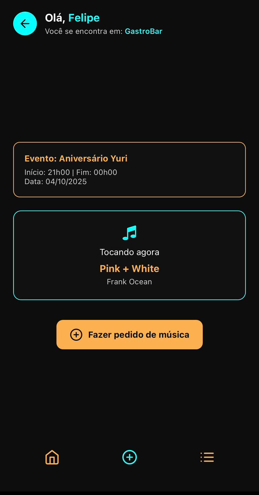
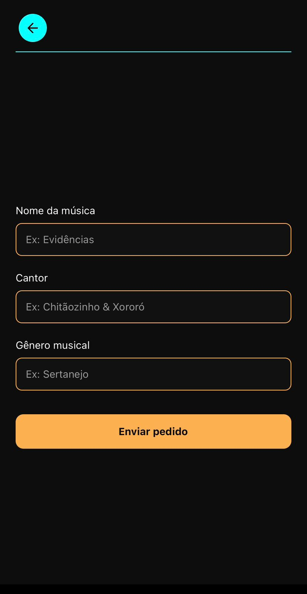
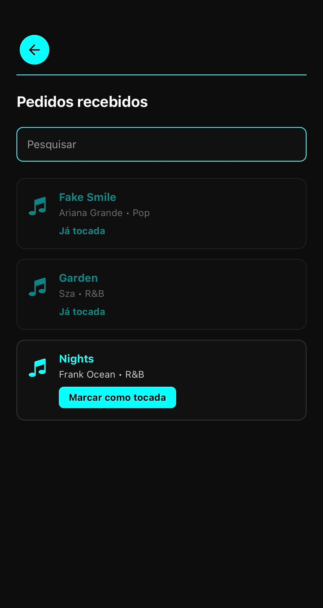

# M&Music

## Integrantes

### 2TDSPR
|  |
|-------------------------------------------|
| 
Felipe Soares Gonçalves
|
| 
RM: 559175
|
| 
[GitHub](https://github.com/fiapfelipe)
|
| 
[Linkedin](https://www.linkedin.com/in/felipe-soares-40bb0125b/)
|

|  |
|-------------------------------------------|
| 
Henrique Batista de Souza
|
| 
RM: 99742
 |
| 
[GitHub](https://github.com/rickfiap)
|
| 
[Linkedin](https://www.linkedin.com/in/henriquebatistadev/)
|

|  |
|-------------------------------------------|
| 
Julia Lima Rodrigues
|
| 
RM: 559781
 |
| 
[GitHub](https://github.com/juliafiap)
|
| 
[Linkedin](http://www.linkedin.com/in/julia-rodrigues-a12a3924b)
|

## Descrição do Projeto
M&Music é um aplicativo móvel que conecta clientes e músicos em bares, permitindo que os clientes façam pedidos de músicas diretamente pelo app, enquanto os músicos visualizam esses pedidos em tempo real, organizam seu repertório e marcam quais músicas já tocaram. Com interfaces personalizadas, o app oferece uma experiência interativa, prática e visualmente consistente.

## Estrutura do Projeto
Aqui estão as seções principais da nossa apresentação. As imagens abaixo representam telas e fluxos da aplicação.

|        |        |
|-------------------------------------------|---------------------------------------------|
| 
Tela de Login
       | 
Tela de Identificação
      |

|     |    |
|-------------------------------------------|---------------------------------------------|
| 
Tela para Cliente
 | 
Tela de Pedidos
 |

|    |           |
|-------------------------------------------|---------------------------------------------|
| 
Tela para Musico
   | 
Tela de pedidos recebidos
       |

## Tecnologias Utilizadas

  
  
  

